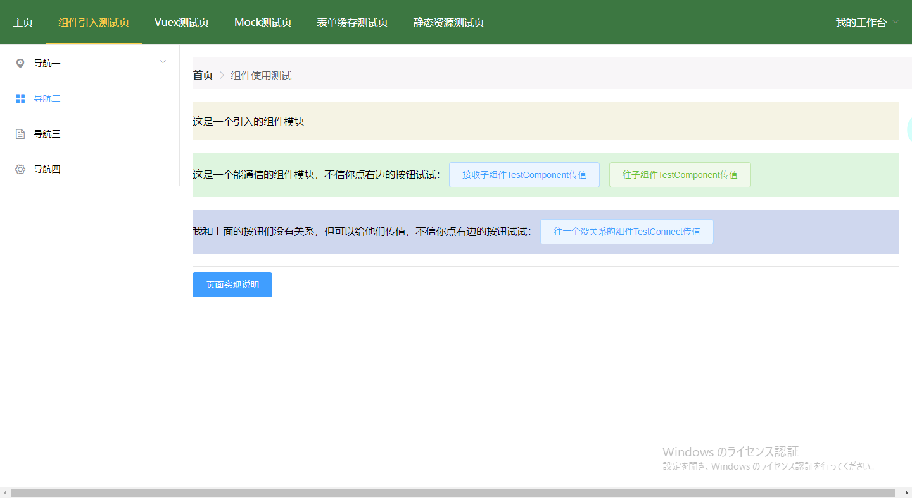

## 说明
该项目主要提供了vue项目的一个架构示例，以及开发当中一些基本内容的简单示例，并尽可能地配上了些许文字说明，旨在能够了解vue的一些常见开发方法

## 主要内容
+ 简单的架构示例
+ 组件的引入和通信
+ vuex的使用
+ mock的使用
+ 页面缓存
+ 静态资源的引入
+ 看心情再加...

## 运行
项目内容很简单，直接正常安装启动就行，命令如下：

``` 
# 安装依赖
npm install
# 直接运行
npm run dev

# 生产环境打包
npm run build
# 可视化打包结果
npm run build --report
```

## 示例图
